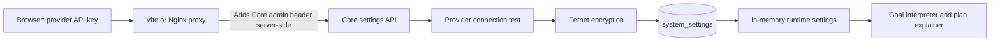

# OptiFlow AI Frontend and LLM Settings Handover

**Owner branch:** `ananth_dev`  
**Prepared:** 2026-07-29  
**Scope:** Guided frontend experience, decision visualisation, secure LLM provider settings, and related Core integration.

## 1. Outcome

OptiFlow now presents a guided decision journey instead of a generic dashboard. A manager can enter a goal, watch each decision stage arrive as a card, inspect the evidence and reasoning behind it, compare plans, approve operational work, follow SAGA execution, and revisit the completed record.

The Settings workspace also supports real Gemini and Groq connections. Users enter only provider API keys. The Core admin key stays in the server-side Vite or Nginx proxy and is never included in browser assets.

The deterministic optimiser, evidence rules, approval gates, and SAGA controls remain authoritative. LLMs assist only with language interpretation and explanations. If no provider is configured or a provider fails, Core continues in rules-only mode.

## 2. Guided Decision Flow


Every visible stage explains:

- What the engine is doing.
- Which checks are running.
- What evidence was used.
- Why a conclusion or recommendation was produced.
- What can stop or delay the route.
- What the user must do next.
- How to perform the same decision manually when AI is unavailable.

## 3. Frontend Work Completed

### 3.1 Navigation and workspace structure

- Reorganised the application around **Today's Goal**.
- Added the Decision Atlas navigation system.
- Added functional workspaces for Overview, Decision Flow, Run History, Demo Lab, and Settings.
- Added persistent light, dark, and system themes.
- Added guided/compact teaching detail, walkthrough pace, and reduced-motion preferences.

### 3.2 Today's Goal experience

- Added a focused goal-entry workspace.
- Added live portfolio context before a goal starts.
- Added sequential journey-card arrival so stages remain readable even when the backend finishes quickly.
- Added truthful playback controls with focused, standard, and deliberate pacing.
- Added explicit waiting, failure, clarification, approval, execution, and completion states.
- Prevented the UI from showing false success after a failed SAGA event.

### 3.3 Decision teaching and visualisation

- Added a clickable decision journey ledger.
- Added evidence-backed step inspection.
- Added causal evidence maps showing why an outcome happened.
- Added confidence and autonomy-risk explanations.
- Added side-by-side plan trade-off comparison.
- Added governed approval, modification, rejection, cancellation, and clarification controls.
- Added detailed stalled-route, replanning, recovery, and compensation teaching.
- Added an execution relay explaining each SAGA boundary and receipt.

### 3.4 Portfolio and outcome views

- Added a live portfolio pressure explorer.
- Added customer, incident, specialist, capacity, SLA, and ARR context.
- Added evidence-based completion summaries.
- Added clear separation between recorded facts, calculated metrics, and explanatory narrative.

### 3.5 History and Demo Lab

- Turned Run History into a decision-memory workspace.
- Added filters for routes needing attention, routes still moving, and closed routes.
- Added goal reuse and route reopening.
- Added controlled specialist-response and service-failure scenarios.
- Added meaningful explanations of what each scenario tests and what the user should observe.

## 4. Secure LLM Settings

### 4.1 User experience

Users can:

1. Choose **Rules-only** or **AI-assisted**.
2. Select Google Gemini or GroqCloud.
3. Select a server-supported model.
4. Enter a primary API key and up to two backup keys.
5. Test credentials without saving.
6. Connect a provider and save credentials securely.
7. View only masked saved credentials.
8. Disconnect the provider and return Core to rules-only mode.

The UI no longer asks for the Core admin key.

### 4.2 Provider request path



### 4.3 Security controls

- Provider keys use Pydantic `SecretStr` at the API boundary.
- Core validates provider names, model names, key count, labels, and priorities.
- Credentials are encrypted before database persistence.
- GET responses return masked values only.
- Keys are excluded from graph checkpoints, events, logs, and browser storage.
- The browser bundle contains neither `ADMIN_API_KEY` nor its value.
- Vite reads the root `.env` server-side during local development.
- Nginx receives `ADMIN_API_KEY` as a container environment variable and injects it only into the secure settings proxy.
- Direct Core settings changes still require `X-Admin-Key`.

### 4.4 Backup-key behaviour

Keys are tried in priority order for recoverable failures such as:

- Authentication or permission failure.
- Rate limit or quota exhaustion.
- Timeout or connection failure.
- Provider overload or temporary server failure.

Core does not silently change the chosen provider or model.

### 4.5 Runtime reproducibility

Graph state records:

- `llm_mode`
- `llm_provider`
- `llm_model`

API keys are retrieved dynamically from the settings service and are never stored in graph state. This preserves provider/model history while allowing credential rotation or disconnection.

## 5. Secure Settings API

| Method | Route | Purpose |
|---|---|---|
| `GET` | `/api/v1/settings/llm/models` | Return the server-owned provider/model catalog. |
| `GET` | `/api/v1/settings/llm` | Return current mode and masked provider status. |
| `POST` | `/api/v1/settings/llm/test` | Test credentials without saving. |
| `POST` | `/api/v1/settings/llm` | Validate, encrypt, save, and activate a provider. |
| `POST` | `/api/v1/settings/llm/disconnect` | Remove credentials or return to rules-only mode. |

The settings object uses schema version `1`.

## 6. Important Files

### Frontend

- `frontend/src/pages/WorkspacePages.tsx`
- `frontend/src/pages/ControlRoomPage.tsx`
- `frontend/src/pages/RunCockpitPage.tsx`
- `frontend/src/pages/DemoLabPage.tsx`
- `frontend/src/components/run/DecisionJourneyRail.tsx`
- `frontend/src/components/run/CausalEvidenceMap.tsx`
- `frontend/src/components/run/DecisionTrustPanel.tsx`
- `frontend/src/components/run/ExecutionRelay.tsx`
- `frontend/src/components/run/PlaybackControls.tsx`
- `frontend/src/components/portfolio/PortfolioPulse.tsx`
- `frontend/src/api/client.ts`
- `frontend/src/types/api.ts`
- `frontend/src/preferences.ts`
- `frontend/src/theme.ts`
- `frontend/vite.config.ts`
- `frontend/nginx.conf`

### Core

- `core-api/app/llm_settings/routes.py`
- `core-api/app/llm_settings/schemas.py`
- `core-api/app/llm_settings/service.py`
- `core-api/app/config/models.py`
- `core-api/app/goals/providers.py`
- `core-api/app/goals/interpreter.py`
- `core-api/app/optimizer/explainer.py`
- `core-api/app/agent/state.py`
- `core-api/app/agent/nodes/interpret_goal.py`
- `core-api/app/agent/nodes/generate_plans.py`

### Persistence and deployment

- `core-api/app/database/models.py`
- `database/init.sql`
- `.env.example`
- `docker-compose.yml`
- `frontend/Dockerfile`

## 7. Local Development

### 7.1 Start backend services and database

From the repository root:

```powershell
docker compose --profile full-stack up -d `
  postgres `
  crm-service `
  incident-service `
  workforce-service `
  communication-service `
  core-api
```

Verify:

```powershell
docker compose --profile full-stack ps
Invoke-RestMethod http://localhost:8000/health
Invoke-RestMethod http://localhost:8000/api/v1/settings/llm/models
```

### 7.2 Start the frontend separately

```powershell
Set-Location frontend
npm.cmd ci
npm.cmd run dev
```

Open:

- Frontend: `http://127.0.0.1:3000`
- Settings: `http://127.0.0.1:3000/settings`
- Core API docs: `http://localhost:8000/docs`

The local Vite server reads `ADMIN_API_KEY` from the root `.env` and adds it to settings requests server-side.

## 8. Testing Keys

### Core admin key for direct local API testing only

Read the development value from `ADMIN_API_KEY` in the local root `.env`. The
key is development-only, must not be copied into documentation, and is no longer
entered in the UI.

For a direct request to Core, send it as:

```http
X-Admin-Key: <value from local ADMIN_API_KEY>
```

### Provider key

A real Gemini or Groq API key is still required to activate AI-assisted mode. A fake key is expected to return a provider-rejection result and is never saved.

Never commit real provider keys or production admin keys.

## 9. Validation Completed

- Frontend TypeScript and Vite production build passed.
- The frontend proxy reached the live Core settings API.
- A fake provider key passed Core proxy authentication and was rejected at the provider layer, proving server-side Core authorization works.
- Browser build artifacts were checked and contained no Core admin key.
- Docker Compose configuration validation passed.
- Focused Core settings/planning/explainer suite: **20 passed**.
- Full Core unit suite at the time of validation: **73 passed, 1 failed**.
- Core health endpoint returned `UP`.
- Worktree was clean after commits.

## 10. Known Remaining Work

### 10.1 Real provider verification

No real Gemini or Groq credential was supplied during implementation. The complete request, rejection, encryption, masking, runtime, and fallback paths were tested, but a successful live provider connection must be verified with a real key.

### 10.2 Existing solver test failure

`tests/unit/test_solver.py::test_generate_optimization_plans` expects two allocations while its specialist fixtures omit the active/availability flags required by the current solver filter. This was pre-existing and was not changed as part of the settings work.

### 10.3 Production user authentication

The current server proxy assumes that anyone allowed to access the Settings page is trusted to change provider configuration. A production multi-user deployment should replace this trust boundary with authenticated administrator sessions and role checks.

### 10.4 Backend state semantics

The UI guards against a failed SAGA being displayed as successful. Core completion behaviour after `FAILED_SAGA` should still be re-verified with the latest backend integration work before final release.

### 10.5 Branch integration

At the time of this document:

- `ananth_dev` contains the complete settings implementation and proxy correction through commit `b2fe1bb`.
- `develop` and `main` point to `e9df158`.
- The final three provider-settings commits still require review before merging into `develop` and `main`.

## 11. Main Commits

### Guided UI and UX

- `ba72076` — typed decision data foundation
- `184504c` — Decision Atlas navigation
- `e8dd4df` — live portfolio decision context
- `ae15d1d` — truthful guided playback
- `b8cd40f` — clickable decision journey ledger
- `75497a5` — Today's Goal workspace organisation
- `e0bbdfd` — persistent theme foundation
- `05fe875` — Today's Goal workspace
- `db59ade` — sequential journey cards
- `ca1bc2c` — evidence-backed step inspector
- `9d24dbc` — decision causality visualisation
- `abff300` — confidence and risk explanation
- `f038500` — plan trade-off comparison
- `0aa651c` — governed decision controls
- `64e59a7` — stalled-route explanation
- `517f875` — SAGA execution and recovery teaching
- `247a279` — decision-memory run history
- `835e3da` — actionable Demo Lab
- `35175de` — walkthrough preferences
- `ae45d18` — evidence-based outcome summaries
- `1e6366e` — portfolio pressure explorer
- `c9f08be` — saved teaching detail
- `e9df158` — explicit reduced-motion support

### LLM settings and persistence

- `2311cd1` — versioned LLM settings foundation
- `6e9bfd7` — encryption dependency
- `d34609b` — encrypted `system_settings` persistence
- `63d9760` — initial secure Settings UI
- `ae585ab` — active secure LLM settings API and runtime
- `a23cd16` — connected frontend provider settings
- `b2fe1bb` — server-side Core authorization proxy

## 12. Handover Summary

The guided UI and secure provider flow are implemented on `ananth_dev`. The application remains fully usable in deterministic rules-only mode. With a valid provider key, AI-assisted interpretation and plan explanations become active while optimisation, evidence checks, approval, and execution remain governed by deterministic Core logic.
