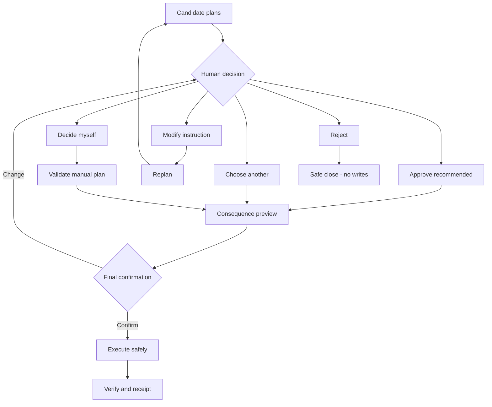

# OptiFlow Next-Phase UI Plan

## Purpose

The next UI phase should turn OptiFlow into a live, visual decision workspace.
A manager should understand the current situation, compare consequences, give a
different instruction, reject an unsafe recommendation, and verify the result
without reading long paragraphs.

The interface should use animation and pictures to explain the decision, while
keeping complete evidence and audit data available on demand.

## Product Principles

1. Show the decision map first.
2. Use numbers, colour, motion, icons, and spatial relationships before prose.
3. Reveal only the detail requested by the user.
4. Clearly separate live operational data from the snapshot used by a plan.
5. Never execute a recommendation without an explicit human decision.
6. Allow the human to approve, select another plan, modify, decide manually, or
   reject.
7. Explain the consequence before any operational write.
8. Keep rejected, failed, compensated, and alternate routes visible.
9. Make every animation optional through reduced-motion settings.
10. Preserve a complete audit trail even when the default screen is minimal.

## Primary Screen

The run screen should contain three main areas.

### 1. Goal and live state

Show:

- the active goal;
- run status;
- evidence snapshot time;
- whether newer live data exists;
- a short warning when the recommendation may be stale.

Example:

`Plan snapshot 10:04 | Live data 10:07 | 2 inputs changed`

When important evidence changes, show one primary action:

`Recalculate route`

### 2. Animated decision map

Use the following main route:

`Goal -> Interpret -> Guard -> Evidence -> Plans -> Human decision -> Execute -> Verify`

Keep alternate branches visible:

- clarification;
- safe stop;
- modify and replan;
- reject;
- manual decision;
- execution recovery.

The map should visually distinguish:

- completed and recorded steps;
- the current active step;
- waiting steps;
- human-controlled gates;
- alternate routes;
- failed or compensated routes.

### 3. Selected-node card

Clicking any node opens one readable card directly below the map.

The card shows:

- **Data** - the most important evidence used by this step;
- **Why** - the recorded reason for the result;
- **If changed** - what evidence or human choice would change the route;
- **View all data** - complete clients, incidents, workers, plans, events, and
  payloads.

The card must not use several competing explanation panels. One selected node
equals one explanation card.

## Human Decision Gate

The human decision gate must support five explicit choices.

### Approve recommended

Approve the Core-recommended candidate without changing it.

Before confirmation, show:

- protected clients;
- assigned and waiting incidents;
- worker capacity before and after;
- expected SLA, revenue, and fairness effects;
- any unresolved risk.

### Choose another plan

Allow selection of SLA-first, revenue-first, fairness-first, balanced, or any
future candidate returned by Core.

Switching candidates should animate the consequence differences without
executing anything.

### Modify

Allow the manager to tell OptiFlow what should change.

Examples:

- "Do not assign new work to Maya."
- "Protect Alpha Bank first."
- "Keep every worker below 80 percent utilisation."
- "Leave the low-severity incident unassigned today."

Modification flow:

1. Human enters the requested change.
2. Core interprets it as proposed structured constraints.
3. UI shows what Core understood.
4. Human corrects or confirms the interpretation.
5. Core replans.
6. UI animates the changed plan and its consequences.
7. Human approves, modifies again, or rejects.

Raw human text must never directly trigger operational writes.

### Decide myself

Allow the manager to create a manual decision instead of using a generated
candidate.

The manager can:

- select which incidents should be handled;
- select or exclude workers;
- create incident-to-worker assignments;
- set client priority;
- leave an incident intentionally unassigned;
- add a reason or note.

The UI should support both:

- visual drag-and-drop assignments; and
- a natural-language instruction box.

Manual decision flow:

1. Human creates the proposed decision.
2. Core validates availability, capacity, skills, policy, and conflicts.
3. Invalid choices are highlighted next to the affected node.
4. Safe choices produce a before/after preview.
5. Human gives final confirmation.
6. The validated manual plan is executed through the same saga and audit path
   as a generated plan.

The system may warn or block an unsafe decision according to policy, but it must
always explain the exact reason.

### Reject

Reject must be a first-class decision, not a hidden secondary button.

Reject flow:

1. Human selects **Reject**.
2. UI asks for an optional or policy-required reason.
3. UI clearly states that no plan will execute.
4. Human confirms rejection.
5. Core records the rejection and safely closes or pauses the run.

Suggested rejection reasons:

- recommendation does not match business priority;
- evidence is incomplete or stale;
- worker capacity is not acceptable;
- customer context is missing;
- manager will handle the decision manually;
- decision should be postponed;
- other.

After rejection, show:

- `No operational changes made`;
- the rejection reason;
- rejected plan ID and evidence version;
- options to revise the goal, modify constraints, or start a new run.

## Decision-Gate Flow



## Visual and Animated Features

### Animated evidence packets

When evidence is collected, small packets travel from source systems into the
Evidence node.

Examples:

- `CRM | 8 clients`
- `Incidents | 5 urgent`
- `Workforce | 4/8 ready`
- `Communication | standby`

Selecting a packet opens the corresponding evidence inside the node card.

### Client risk constellation

Represent clients as bubbles:

- bubble size = commercial exposure;
- colour = highest active severity;
- outer ring = SLA pressure;
- orbiting dots = active incidents;
- check mark = protected by the selected plan.

Selecting a client highlights its incidents, candidate assignments, and reason
for its priority.

### Worker capacity orbits

Represent each worker with a circular capacity gauge:

- green = free capacity;
- violet = reserved capacity;
- orange = near capacity;
- red = unavailable or blocked;
- inner icons = skills.

Selecting a worker highlights:

- incidents they can handle;
- skill matches;
- proposed new assignments;
- remaining capacity after the plan;
- reasons they were excluded.

### Plan consequence animation

When the user switches plans, animate:

- incidents moving to workers;
- clients becoming protected or waiting;
- capacity gauges filling or freeing;
- changed SLA, revenue, and fairness scores;
- newly unassigned incidents.

No animation should imply that execution occurred. Use labels such as
`Preview` and `Not applied`.

### Before-and-after view

Show current state on the left and the selected plan on the right.

Default visual summary:

- incidents assigned;
- incidents waiting;
- customers protected;
- ARR protected;
- maximum worker utilisation;
- available capacity remaining.

The complete allocation table remains expandable.

### Why-this-plan comparison

Show three or four large visual scores instead of paragraphs:

- SLA protection;
- customer value;
- workload fairness;
- capacity safety.

Use arrows to show the consequence of switching plans:

`SLA up | Revenue same | Fairness down`

### Decision playback

Provide:

`Back | Play/Pause | Next | Live`

Playback highlights one node at a time and animates only the evidence relevant
to that node.

The user can select any completed node without interrupting the live run.

### Human-gate animation

Human-controlled states should be visually unmistakable:

- clarification = orange pause;
- approval = amber gate;
- modify = violet loop to Plans;
- decide myself = blue manual branch;
- reject = red safe-close branch;
- execution = moving verified steps;
- recovery = reverse or compensation animation.

### Outcome receipt

The Verify node should transform into a compact visual receipt:

- customers protected;
- incidents assigned;
- incidents left waiting;
- reservations confirmed;
- notifications delivered;
- failed and compensated operations;
- final capacity;
- selected plan and human decision.

The complete execution receipt remains expandable and downloadable.

## Dynamic Data Behaviour

### Before planning

Each new run must fetch the latest clients, incidents, severities, SLA
deadlines, workforce availability, workload, and reservations.

Changing any of these inputs must be able to change:

- priority order;
- eligible workers;
- candidate allocations;
- plan metrics;
- recommendation;
- confidence and risk.

### During approval

The recommendation must be tied to an immutable evidence snapshot.

If live operational data changes while approval is waiting:

1. Compare the current data version with the plan snapshot version.
2. Highlight changed clients, incidents, severities, or workers.
3. Mark the recommendation as potentially stale.
4. Prevent silent execution of the stale plan.
5. Offer **Recalculate route**.

### After approval

The approved plan remains an audit record. Live data may continue changing, but
the UI must not rewrite the historical explanation.

Show:

- `Plan snapshot`;
- `Live now`;
- a visual delta between them.

## Progressive Disclosure

Default view:

- one goal;
- one decision map;
- compact evidence packets;
- one selected-node card;
- one human action area.

First expansion:

- complete priority reasons;
- worker match details;
- plan consequences;
- alternatives.

Second expansion:

- all records;
- raw event payloads;
- optimiser metadata;
- execution receipts;
- audit timestamps and IDs.

## Accessibility and Usability

- Normal body text starts at 16 px.
- Important labels should not render below 12 px.
- Click targets should be at least 44 by 44 px.
- Colour must never be the only status indicator.
- Every animated state must have a static equivalent.
- Respect system and saved reduced-motion preferences.
- Support keyboard node navigation and visible focus.
- Announce live status changes without repeatedly interrupting screen readers.
- Preserve readable contrast in both themes.
- Keep mobile actions sticky when human input is required.

## Required Backend Contracts

### Evidence snapshot identity

Each run status should expose:

```json
{
  "evidence_snapshot_id": "SNAP-0012",
  "evidence_snapshot_version": 12,
  "evidence_captured_at": "2026-07-30T10:04:00Z",
  "live_data_version": 14,
  "evidence_changed": true,
  "changed_entities": [
    {
      "entity_type": "incident",
      "entity_id": "INC-0042",
      "changed_fields": ["severity", "sla_deadline"]
    }
  ]
}
```

### Structured modification

```json
{
  "instruction": "Do not assign new work to Maya",
  "interpreted_constraints": [
    {
      "type": "EXCLUDE_SPECIALIST",
      "specialist_id": "SPEC-MAYA"
    }
  ],
  "requires_confirmation": true
}
```

### Manual plan

```json
{
  "decision_type": "MANUAL",
  "reason": "Customer commitment made in executive call",
  "allocations": [
    {
      "incident_id": "INC-0042",
      "specialist_id": "SPEC-001"
    }
  ],
  "intentionally_unassigned_incidents": ["INC-0047"]
}
```

Core should return validation results before accepting final confirmation.

### Rejection

```json
{
  "approval_status": "REJECTED",
  "reason_code": "BUSINESS_PRIORITY_MISMATCH",
  "reason": "Protect Orbit Telecom before Alpha Bank",
  "plan_id": "PLAN-SLA_FIRST",
  "evidence_snapshot_id": "SNAP-0012"
}
```

## Frontend State Model

The decision gate should use explicit states:

- `VIEWING_RECOMMENDATION`;
- `PREVIEWING_ALTERNATIVE`;
- `EDITING_MODIFICATION`;
- `CONFIRMING_INTERPRETATION`;
- `REPLANNING`;
- `BUILDING_MANUAL_PLAN`;
- `VALIDATING_MANUAL_PLAN`;
- `CONFIRMING_EXECUTION`;
- `CONFIRMING_REJECTION`;
- `REJECTED`;
- `EXECUTING`;
- `COMPLETED`;
- `RECOVERED`;
- `FAILED`.

The interface must not infer execution from animation or local state. Backend
status and recorded events remain authoritative.

## Implementation Phases

### Phase 1 - Complete human decision controls

- Add visible Approve, Choose another, Modify, Decide myself, and Reject
  actions.
- Add rejection reason capture and safe-close confirmation.
- Add human modification input with interpretation confirmation.
- Preserve explicit final confirmation.

### Phase 2 - Consequence preview

- Add visual before-and-after comparison.
- Animate plan switching.
- Highlight protected, waiting, newly assigned, and overloaded entities.
- Keep all previews non-executing.

### Phase 3 - Dynamic evidence and staleness

- Add evidence snapshot and live data versions.
- Detect material changes during approval.
- Add visual delta and Recalculate route.
- Prevent silent execution of stale evidence.

### Phase 4 - Manual decision builder

- Add drag-and-drop incident assignments.
- Add natural-language manual instructions.
- Validate skills, availability, capacity, conflicts, and policy.
- Show inline correction guidance.
- Execute only a validated and confirmed manual plan.

### Phase 5 - Visual storytelling

- Add evidence packets.
- Add client constellation and worker capacity orbits.
- Add decision playback.
- Add human-gate, replanning, recovery, and outcome animations.

### Phase 6 - Accessibility and responsive validation

- Test desktop, tablet, and mobile layouts.
- Test keyboard-only interaction.
- Test screen-reader status updates.
- Test reduced motion.
- Test both themes and zoom up to 200 percent.

## Suggested Scoped Commits

1. `feat(ui): add complete human decision gate`
2. `feat(ui): capture rejection reasons safely`
3. `feat(ui): confirm human modification intent`
4. `feat(ui): preview plan consequences visually`
5. `feat(core): expose evidence snapshot versions`
6. `feat(ui): detect stale decision evidence`
7. `feat(ui): build validated manual decisions`
8. `feat(ui): animate evidence and capacity changes`
9. `feat(ui): add decision playback and receipts`
10. `test(ui): validate accessible decision journeys`

## Acceptance Criteria

- A manager can reject a recommendation and confirm that no writes occurred.
- A manager can explain why they rejected it.
- A manager can tell OptiFlow how to modify the decision.
- The interpreted modification is shown before replanning.
- A manager can build and validate a manual decision.
- No raw human text directly triggers an operational write.
- Switching candidate plans animates the changed consequences.
- Client and severity changes affect new rankings and plans.
- Evidence changes during approval are detected and clearly shown.
- A stale plan cannot execute silently.
- Clicking each decision node opens one readable explanation card.
- Complete data remains available through progressive disclosure.
- The map never advances beyond recorded backend state.
- All actions and outcomes remain auditable.
- The interface remains usable with reduced motion, keyboard navigation, and
  200 percent zoom.

